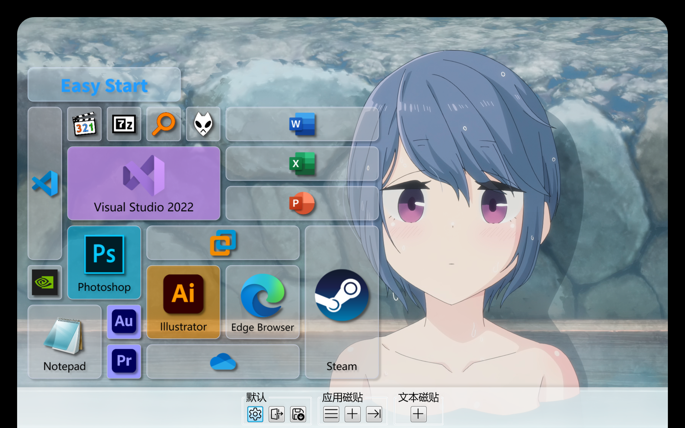

# EasyStart

  

| [中文](./README.md) | English |
| :-----------------: | :-----: |

An upgraded C# remake of the Windows Start Menu tile.

- Supports application tiles, text tiles, and image tiles
- Supports seven sizes: small (1x1), medium (2x2), wide (2x4), thin (1x4), tall (4x2), long (4x1), and large (4x4)
- Infinite canvas
- Free drag
- Quickly pin application tiles

## Configuration files

All configuration files are portable

- `settings.json` saves application settings
- `tiles.xml` saves tiles
- Manual modification may cause tile loss

## Download

[Release](https://github.com/KaiHuaDou/EasyStart/releases/latest) page to get the latest version

## Build

Get the latest build through [GitHub Actions](https://github.com/KaiHuaDou/EasyStart/actions)

To build locally, run the following command, which requires `.NET 9.0 SDK` or higher:

```bash
git clone --depth=1 https://github.com/KaiHuaDou/EasyStart.git
cd EasyStart
dotnet build
```

To build a release version, run:

```bash
dotnet publish -p:PublishProfile=FolderProfile
```

## Screenshot


