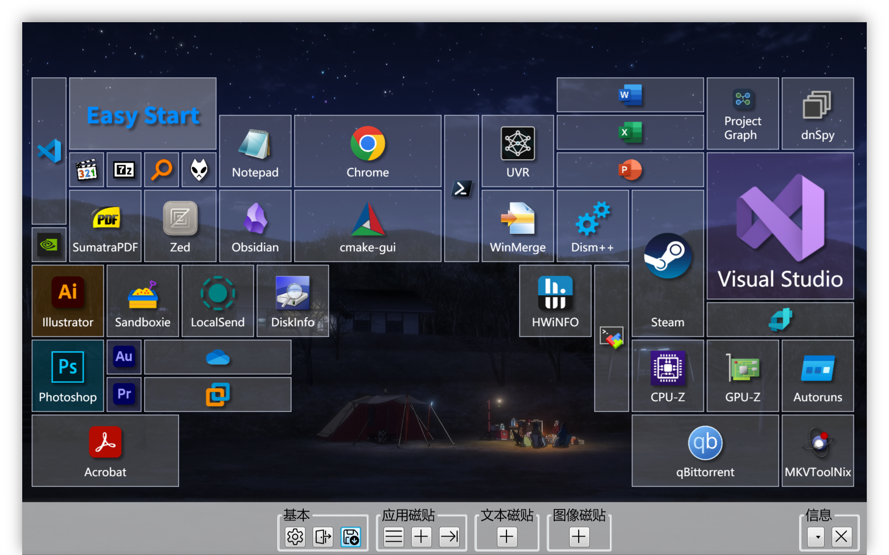

# EasyStart

  

| 中文  | [English](./README.en.md) |
| :---: | :-----------------------: |

使用 C# + WPF 重写的 Windows 10 开始屏幕磁贴。

- 支持应用磁贴、文本磁贴、图像磁贴
- 支持小 (1x1)、中 (2x2)、宽 (2x4)、薄 (1x4)、高 (4x2)、长 (4x1)、大 (4x4) 七种尺寸
- 支持自定义字号、字体、前景色、背景色
- 无限画布、自由拖动
- 从系统开始菜单导入

## 快捷键

使用 <kbd>Ctrl</kbd>+<kbd>Win</kbd> 切换开始菜单的显示与隐藏。

## 配置文件

所有配置文件都是便携的

- `settings.json` 保存应用程序设置
- `tiles.xml` 保存磁贴

## 下载

[Release](https://github.com/KaiHuaDou/EasyStart/releases/latest) 页面获取最新版本

## 构建

通过 [GitHub Actions](https://github.com/KaiHuaDou/EasyStart/actions) 获取最新构建

本地构建运行以下命令即可，需要`.NET 9 SDK`或更高版本：

```bash
git clone --depth=1 https://github.com/KaiHuaDou/EasyStart.git
cd EasyStart
dotnet build
```

如需构建发布版本，请运行：

```bash
dotnet publish -p:PublishProfile=FolderProfile
```

## 屏幕截图

Aero 风格 (`UIFlat = false`)：


Metro 风格 (`UIFlat = true`)：

